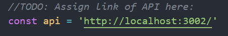
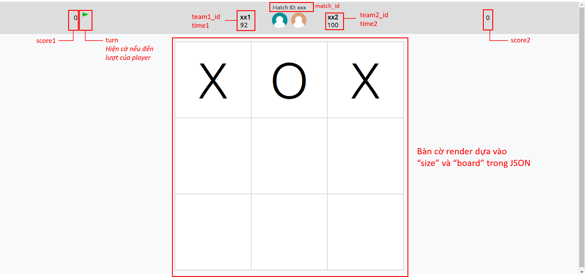

# How to use
<h3>Requirements</h3>
<ul>
<li>Node.js v16.16.0 is required to run</li>
<li>Download Node.js: <a href="https://nodejs.org/en/download">Link</a></li>
<li>Use terminal, cd to <i>frontend</i> and run: <pre>npm install</pre>
</ul>

<h3>How to run the frontend server</h3>
<ol>
<li>Open <i>frontend/public/script.js</i></li>
<li>Paste the referee server link to <i>api</i> in <i>script.js</i></li>
</img>
<li>Run: <pre>npm start</pre>
<li>Enter room_id from the referee server (default is 123), if matches, script will fetch JSON from API and re-render each second</li>
</ol>

<h3>Preview</h3>
</img>
