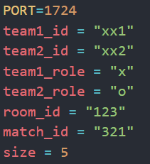

# Referee server
## How to run:
1. Use `pip install -r requirements.txt` in terminal to download the necessary libraries
2. Run `python app.py` 
3. Copy the referee server address and this information to run backend server and frontend server: 

    
